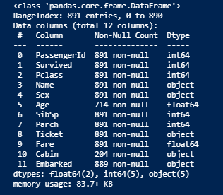
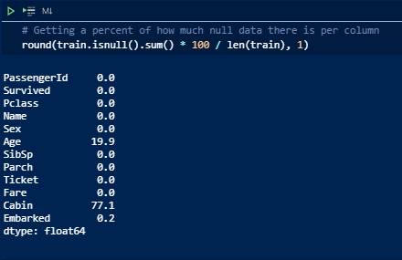
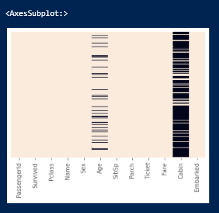
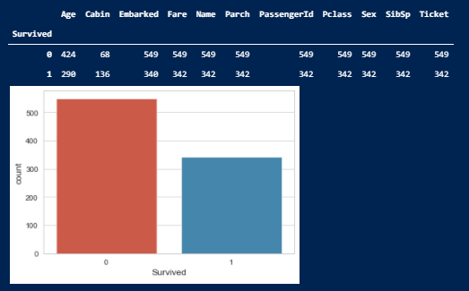
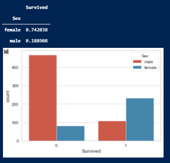

# titanic_dataset

## Purpose

As detailed in Kaggle in the image above, the purpose of this challenge is to examine data regarding the sinking of the Titanic to build a predictive model of survivability.

I will attempt to answer the following questions in my own analysis of this dataset:

- Did wealth determine how likely you were to survive? If so by how much?

- Was age a determining factor in a person's survivability rate?

### **Exploratory Data Analysis**

This part of the analysis focuses on familiarizing ourselves with the data and exploring it for any potential problems or special considerations.

A good place to start is to look at the columns of the training data and their respective data type. This ensures that all data collected will be able to be manipulated accordingly.

Right away we can identify some key points within our data.

- The Age and Cabin columns have a significant number of missing values

- Columns can generally be classified into two main groups - numeric data types and categorical data

- Some columns may need to be dropped from our training data as they may not contribute to our algorith in determining survival rates - for instance Name and PassengerId

Addressing the first of these points, it is helpful to quantify what percentage of the data in he Age and Cabin columns is null

 

As shown above roughly 20% and 77% of the data is missing in the Age and Cabin columns respectively. When dealing with missing values the most common practices are to use filler data (imputation) or drop the missing data, which can lead to omission of the data all together depending on the amount missing. These will be considerations that are explored in the data manipulation step of this analysis.

To get a better idea of how the data is distributed in the data set we can also look at how many of the passengers onboard the Titanic survived across the columns. 

Just from looking at the pivot table we can see that there were some factors that appear to have a stronger correlations with survival rates than others.

In order to dig a little deeper, we should look at the individual variables that we believe would impact a persons chances of surviving. First we will look at gender, as it is common practice to prioritize women and children in emergencies.

As expected, it looks like women had much higher rates of survival than men did!

Another factor that one can assume had a high impact on chances of surival is wealth. Luckily our dataset has good indicators for socioeconomic standing of individuals in the form of passenger class and Fare. 

## Analysis