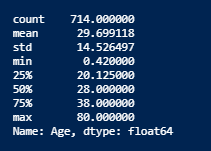
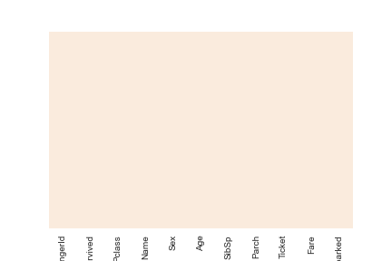
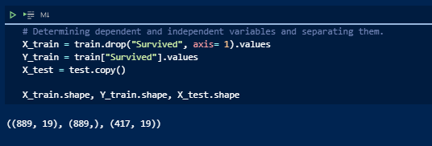
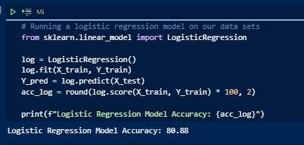
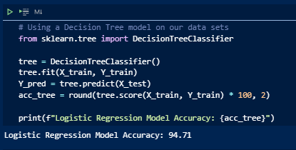
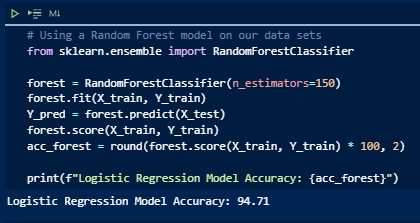
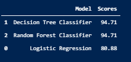
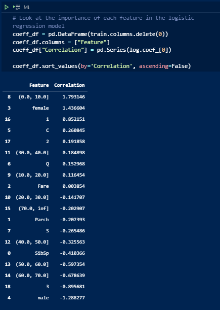

# titanic_dataset

## Purpose

As detailed in Kaggle in the image above, the purpose of this challenge is to examine data regarding the sinking of the Titanic to build a predictive model of survivability.

I will attempt to answer the following questions in my own analysis of this dataset:

- Did wealth determine how likely you were to survive? If so by how much?

- Was age a determining factor in a person's survivability rate?

### **Exploratory Data Analysis**

This part of the analysis focuses on familiarizing ourselves with the data and exploring it for any potential problems or special considerations.

A good place to start is to look at the columns of the training data and their respective data type. This ensures that all data collected will be able to be manipulated accordingly.

Right away we can identify some key points within our data.

- The Age and Cabin columns have a significant number of missing values

- Columns can generally be classified into two main groups - numeric data types and categorical data

- Some columns may need to be dropped from our training data as they may not contribute to our algorith in determining survival rates - for instance Name and PassengerId

Addressing the first of these points, it is helpful to quantify what percentage of the data in he Age and Cabin columns is null

 

As shown above roughly 20% and 77% of the data is missing in the Age and Cabin columns respectively. When dealing with missing values the most common practices are to use filler data (imputation) or drop the missing data, which can lead to omission of the data all together depending on the amount missing. These will be considerations that are explored in the data manipulation step of this analysis.

To get a better idea of how the data is distributed in the data set we can also look at how many of the passengers onboard the Titanic survived across the columns. 

Because the data is not evenly distributed, meaning 50% died and 50% survived, we can assume that there were some factors that affected survival rates more than others.

In order to dig a little deeper, we should look at the count of survivors across individual columns.

Some of the variables with the largest disparities in survivors appear to be Sex, Pclass, and where passengers Embarked.

First we will look at gender, as it is common practice to prioritize women and children in emergencies.

As expected, it looks like women had much higher rates of survival than men did!

Another factor that one can assume had a high impact on chances of surival is wealth. Luckily our dataset has good indicators for socioeconomic standing of individuals in the form of passenger class and fare.

Based on these images, it is evident that 1st class passengers - those who are wealthier and paid more for their passage - had a much higher chance of suriving the Titanic disaster than their less fortunate counterparts.

Furthermore, if we look at the correlation between the two variables, Sex and Pclass, we can see that combined they paint a much clearer picture on who was likelier to survive.

As previously mentioned, age may also have an impact on who was prioritized as the Titanic was sinking. First we will look at how the Age data is distributed. By vizualizing this distribution, we can identify whether data is skewed and opens up certain avenues for altering data that may improve the performance of machine learning models later on.

Great! It looks as though the Age data follows a normal distribution. However, an even mose useful insight would be a look at survivor rates across the age spectrum. Linking this factor to wealth we should be able to see whether these two variables are strongly correlated with a higher chance of survival. There is a problem with our data however, it would be impractical to look at the survival rate for every unique age in our data. Instead, what we can do is group the age into bins and see survival rates by the ranges. By binning ages into 10 year increments and adding the Pclass variable we are able to see the survival rates among men and women across ranges and wealth!

For a more interactive examination of the training data, I have linked my Tableau workbook below

### **Data Manipulation**

Knowing the details of our data allows us to scrub and alter it more for our uses. We begin by tackling the null value problems that exist in some columns.

Although the ages of the passengers followed a normal distribution, the heatmap performed earlier demonstrated that there were a lot of passengers whose age was not disclosed, roughly 20% of the dataset. Though we could just drop the missing rows, losing 20% of the data seems impractical. An alternate solution is to give these missing values a default value, the analysis will use the median of the ages. Using a boxplot and examining the descriptive statistics of the age column lets us see the quartiles of ages.

Our chart and statistics show that 28 is the median age. As such, this will be that value that will be used to fill the NaN values in the Age column.

Unlike the Age column however, the Cabin column contains many more missing values, a whopping 97%. Data imputation here would be impractical as it would basically mean creating a whole new variable. For these reasons, we will drop the columns.

Similarly, there is are very few values missing from the embarked column and so we will drop those rows as their absence should not have any significant impact on our models ability to predict survivability.

As shown below in an updated heatmap these methods of data manipulation should solve the problem of missing data.

Another issue with our dataset is that it includes several non-numeric columns. Though these columns are important to understanding our data they are incompatible with machine learning models. The columns specifically in question are the PassengerId, Name, Ticket, Sex, Embarked, and Pclass columns. Again, we must choose how to alter the data for the best results in our machine models later. With that in mind our analyses assumes that the PassengerId, Name, and Ticket columns will not be relevant to our models ability to predict survivability; they will be dropped. On the other hand, the Sex, Embarked, Pclass and Age columns are categorical in nature and have been altered because we believe they are important. For these columns the "get_dummies" method is called from the Pandas library to convert all unique values into binary values.

Although using the "get_dummies" method on the columns as they are may be fine for the majority, we must once again alter our Age column as it would be impractical to give all unique ages a binary value. For this we performed the same binning technique as earlier before using the "get_dummies" method. This operation results in 10 unique columns with binary values indicating whether a passenger falls in the respective range.

Now that all of the data is expressed through numeric values and compatible with machine learning models, the original columns that were duplicated into binary values must be dropped - the Sex, Embarked, Pclass, and Age. This is the final update to the training dataset prior to being tested.

It is important to note, that although it was not demonstrated in our notebook the same data manipulation processes were performed on the testing data.

### *Machine Learning Models*

When creating the models in the analyses, we first split our training and testing data. In this case, the two sets were predetermined, nonetheless we must assign them to variables.

The three models chosen in the analyses are a logistic regression, a decision tree model, and the random forest classifier model as shown below.

## Analysis

The results of our machine learning models showed a number of things. Starting from the beginning, we saw that the logistic regression model had a very high accuracy level, about 80% accuracy in predicting the likelehood of survival in the test dataset. Likewise, our Decision Tree and Random Forest Classifier models showed incredibly high accuracy rates, an identical 94.7% accuracy on both.

The logistic regression model was run first in an attempt to see whether our earlier assumptions regarding which features (columns) had a high impact on a passenger's chance of survival. As shown below in a df showing the correlation coefficient of our variables and their impact on the outcome, the features more likely to increase the probability of survival had a higher positive correlation coefficient and vice versa. 

It seems that our assumptions from earlier were correct. The three features that determined a person's chance of survival the most were their age, sex, and wealth. In other words, children between the age ranges of 0 and 10, females, and first class passengers were the most likely to make it out alive. On the other hand men, people in the age range of 60 to 70, and 3rd class passengers were the least likely to have made it out alive.

Though this analyses and our models were insightful, I do believe that the study could be improved. In general, I do not believe that the high accuracy scores reflected in the Decision Tree and Random Forest models were themselves truly accurate. These scores I believe may be inflated by overfitting and may indicate that our data needs to be further cleaned. On that basis, I believe that there were other methods of data manipulation that could have been implemented. For starters, the data imputation for the age of passengers could have been done better. Instead of imputing the median age of all passengers the analyses could have taken the median age by gender or by passenger class. A deeper look into the embarked column may have also provided more insight as it seems there was some correlation with where passengers boarded and who survived. My assumption is that certain sites were more specific to wealthier crowds. Though our analyses did not make use of the passenger's names, I believe that there may have been a way to determine if certain titles like "Mr" indicated a higher chance of survival as they may be informal signals of wealth. Finally, the last metric I would reincorporate in this analyses would be the fare column. As it is a measure of how much individuals paid for their passage, and we established that socioeconomic status was highly telling of an persons likelihood to survive, this metric may be extremely useful to feed into our machine learning models.

## Resources

https://www.kaggle.com/startupsci/titanic-data-science-solutions
