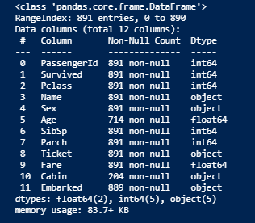
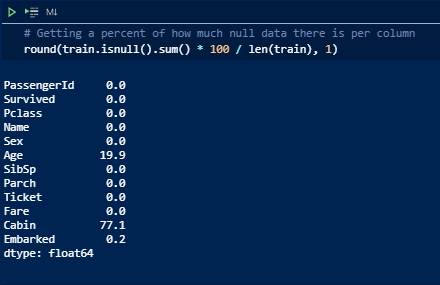
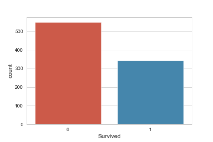
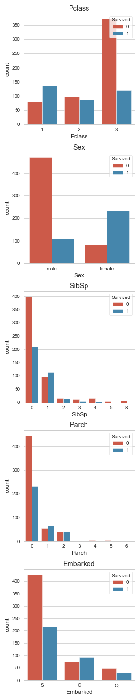
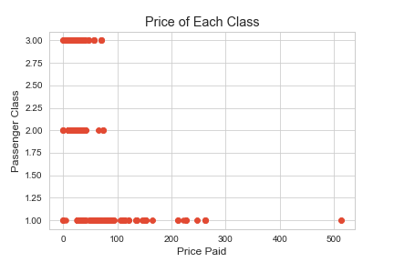
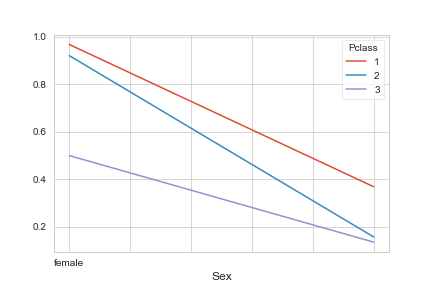
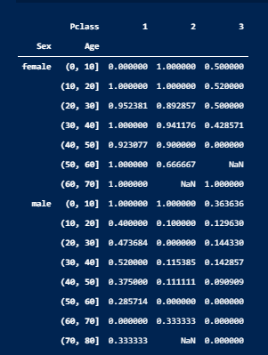
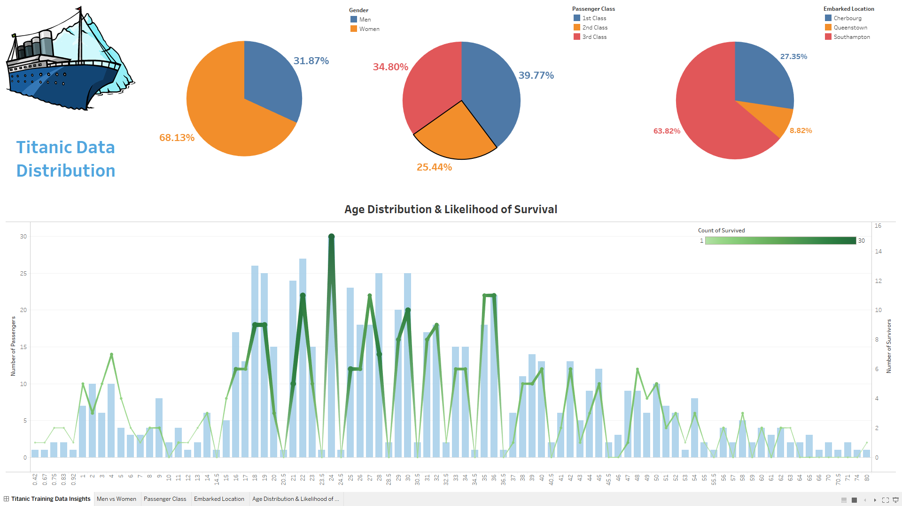

# titanic_dataset

## Purpose

As detailed in Kaggle in the image above, the purpose of this challenge is to examine data regarding the sinking of the Titanic to build a predictive model of survivability.

I will attempt to answer the following questions in my own analysis of this dataset:

- Did wealth determine how likely you were to survive? If so by how much?

- Was age a determining factor in a person's survivability rate?

### **Exploratory Data Analysis**

This part of the analysis focuses on familiarizing ourselves with the data and exploring it for any potential problems or special considerations.

A good place to start is to look at the columns of the training data and their respective data type. This ensures that all data collected will be able to be manipulated accordingly.

Right away we can identify some key points within our data.

- The Age and Cabin columns have a significant number of missing values

- Columns can generally be classified into two main groups - numeric data types and categorical data

- Some columns may need to be dropped from our training data as they may not contribute to our algorith in determining survival rates - for instance Name and PassengerId

Addressing the first of these points, it is helpful to quantify what percentage of the data in he Age and Cabin columns is null

 

As shown above roughly 20% and 77% of the data is missing in the Age and Cabin columns respectively. When dealing with missing values the most common practices are to use filler data (imputation) or drop the missing data, which can lead to omission of the data all together depending on the amount missing. These will be considerations that are explored in the data manipulation step of this analysis.

To get a better idea of how the data is distributed in the data set we can also look at how many of the passengers onboard the Titanic survived across the columns. 

Because the data is not evenly distributed, meaning 50% died and 50% survived, we can assume that there were some factors that affected survival rates more than others.

In order to dig a little deeper, we should look at the count of survivors across individual columns.

Some of the variables with the largest disparities in survivors appear to be Sex, Pclass, and where passengers Embarked.

First we will look at gender, as it is common practice to prioritize women and children in emergencies.

As expected, it looks like women had much higher rates of survival than men did!

Another factor that one can assume had a high impact on chances of surival is wealth. Luckily our dataset has good indicators for socioeconomic standing of individuals in the form of passenger class and fare.

Based on these images, it is evident that 1st class passengers - those who are wealthier and paid more for their passage - had a much higher chance of suriving the Titanic disaster than their less fortunate counterparts.

Furthermore, if we look at the correlation between the two variables, Sex and Pclass, we can see that combined they paint a much clearer picture on who was likelier to survive.

As previously mentioned, age may also have an impact on who was prioritized as the Titanic was sinking. First we will look at how the Age data is distributed. By vizualizing this distribution, we can identify whether data is skewed and opens up certain avenues for altering data that may improve the performance of machine learning models later on.

Great! It looks as though the Age data follows a normal distribution. However, an even mose useful insight would be a look at survivor rates across the age spectrum. Linking this factor to wealth we should be able to see whether these two variables are strongly correlated with a higher chance of survival. There is a problem with our data however, it would be impractical to look at the survival rate for every unique age in our data. Instead, what we can do is group the age into bins and see survival rates by the ranges. By binning ages into 10 year increments and adding the Pclass variable we are able to see the survival rates among men and women across ranges and wealth!

One way of getting an even distribution of these ages would be to identify the quartiles of the data.

For a more interactive examinsation of the training data, I have linked my Tableau workbook below

## Analysis