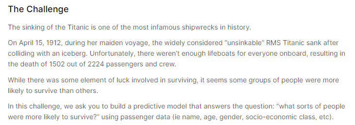

# titanic_dataset

## Purpose

As detailed in Kaggle in the image above, the purpose of this challenge is to examine data regarding the sinking of the Titanic to build a predictive model of survivability.

I will attempt to answer the following questions in my own analysis of this dataset:

- Did wealth determine how likely you were to survive? If so by how much?

- Was age a determining factor in a person's survivability rate?

## Results

### **Exploratory Data Analysis**

## Analysis